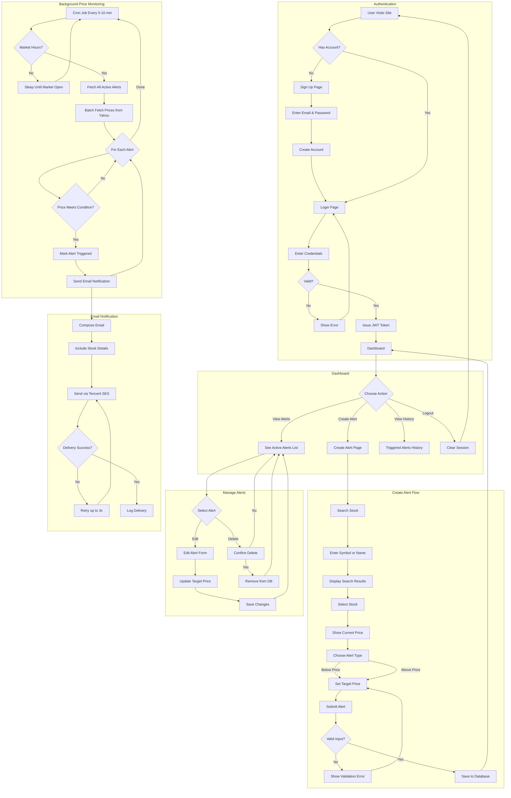
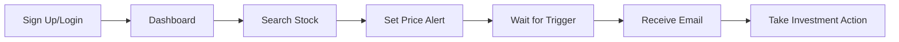
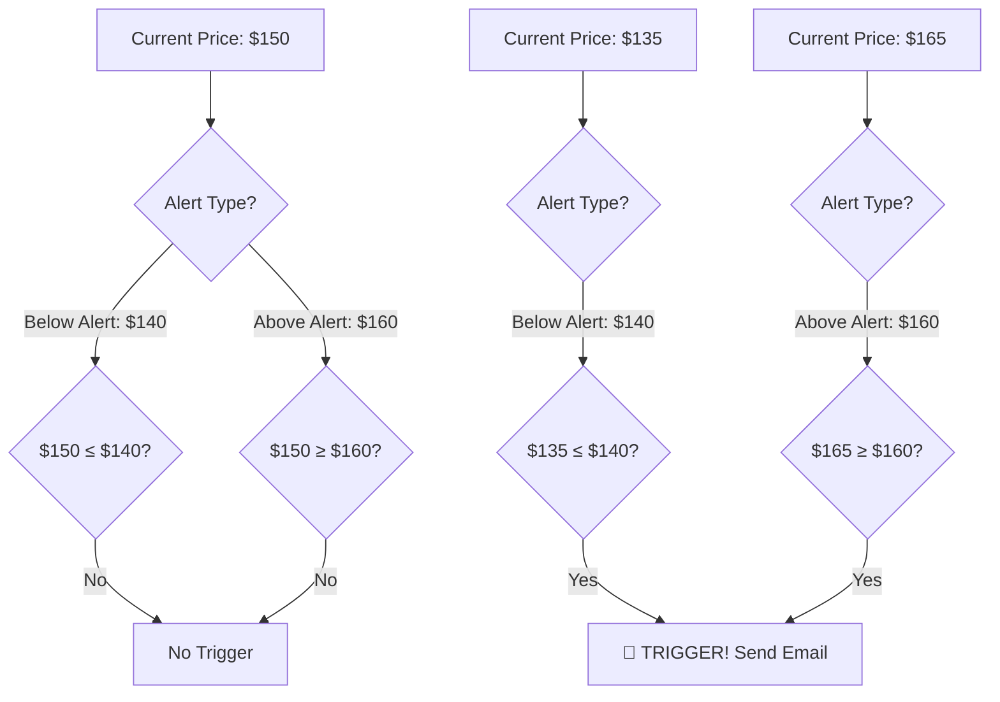
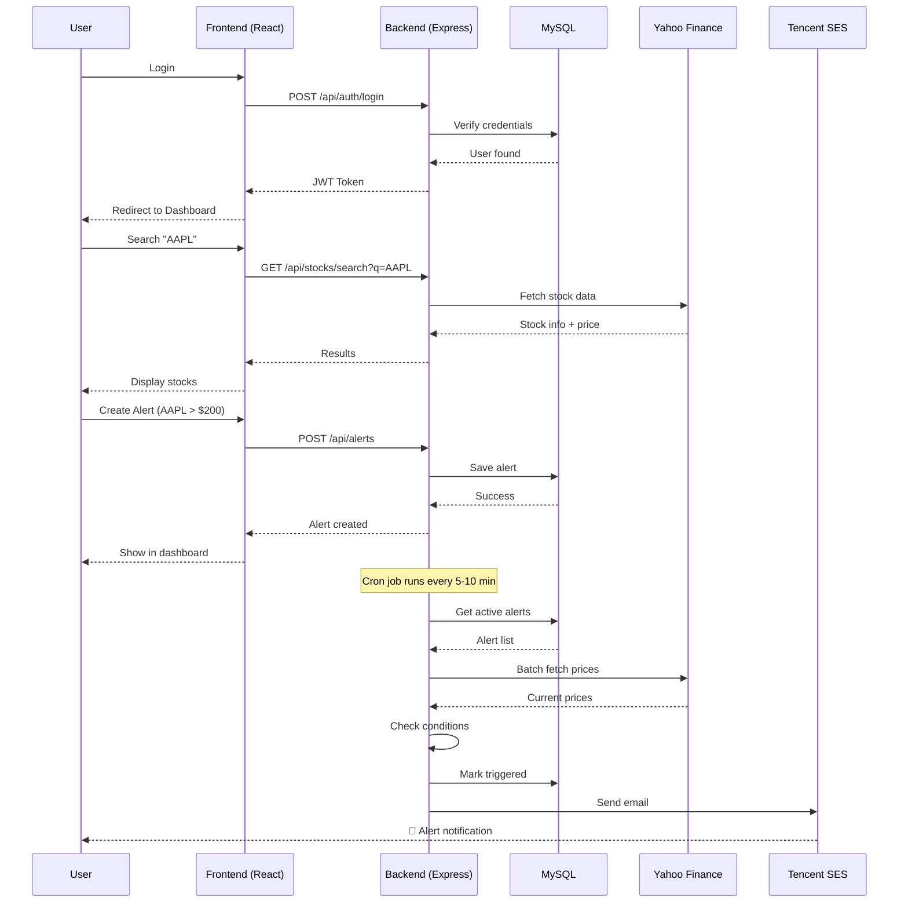

# User Flow Diagram

## Complete User Journey

```mermaid
flowchart TD
    subgraph Authentication
        A[User Visits Site] --> B{Has Account?}
        B -->|No| C[Sign Up Page]
        C --> D[Enter Email & Password]
        D --> E[Create Account]
        E --> F[Login Page]
        B -->|Yes| F
        F --> G[Enter Credentials]
        G --> H{Valid?}
        H -->|No| I[Show Error]
        I --> F
        H -->|Yes| J[Issue JWT Token]
        J --> K[Dashboard]
    end

    subgraph Dashboard
        K --> L{Choose Action}
        L -->|View Alerts| M[See Active Alerts List]
        L -->|Create Alert| N[Create Alert Page]
        L -->|View History| O[Triggered Alerts History]
        L -->|Logout| P[Clear Session]
        P --> A
    end

    subgraph Create Alert Flow
        N --> Q[Search Stock]
        Q --> R[Enter Symbol or Name]
        R --> S[Display Search Results]
        S --> T[Select Stock]
        T --> U[Show Current Price]
        U --> V[Choose Alert Type]
        V -->|Below Price| W[Set Target Price]
        V -->|Above Price| W
        W --> X[Submit Alert]
        X --> Y{Valid Input?}
        Y -->|No| Z[Show Validation Error]
        Z --> W
        Y -->|Yes| AA[Save to Database]
        AA --> K
    end

    subgraph Manage Alerts
        M --> AB{Select Alert}
        AB -->|Edit| AC[Edit Alert Form]
        AC --> AD[Update Target Price]
        AD --> AE[Save Changes]
        AE --> M
        AB -->|Delete| AF[Confirm Delete]
        AF -->|Yes| AG[Remove from DB]
        AG --> M
        AF -->|No| M
    end

    subgraph Background Price Monitoring
        BA[Cron Job Every 5-10 min] --> BB{Market Hours?}
        BB -->|No| BC[Sleep Until Market Open]
        BC --> BA
        BB -->|Yes| BD[Fetch All Active Alerts]
        BD --> BE[Batch Fetch Prices from Yahoo]
        BE --> BF{For Each Alert}
        BF --> BG{Price Meets Condition?}
        BG -->|No| BF
        BG -->|Yes| BH[Mark Alert Triggered]
        BH --> BI[Send Email Notification]
        BI --> BF
        BF -->|Done| BA
    end

    subgraph Email Notification
        BI --> BJ[Compose Email]
        BJ --> BK[Include Stock Details]
        BK --> BL[Send via Tencent SES]
        BL --> BM{Delivery Success?}
        BM -->|No| BN[Retry up to 3x]
        BN --> BL
        BM -->|Yes| BO[Log Delivery]
    end
```

## Simplified User Actions

```mermaid
flowchart LR
    A[Sign Up/Login] --> B[Dashboard]
    B --> C[Search Stock]
    C --> D[Set Price Alert]
    D --> E[Wait for Trigger]
    E --> F[Receive Email]
    F --> G[Take Investment Action]
```

## Alert Trigger Logic

```mermaid
flowchart TD
    A[Current Price: $150] --> B{Alert Type?}
    B -->|Below Alert: $140| C{$150 ≤ $140?}
    C -->|No| D[No Trigger]
    B -->|Above Alert: $160| E{$150 ≥ $160?}
    E -->|No| D
    
    F[Current Price: $135] --> G{Alert Type?}
    G -->|Below Alert: $140| H{$135 ≤ $140?}
    H -->|Yes| I[🔔 TRIGGER! Send Email]
    
    J[Current Price: $165] --> K{Alert Type?}
    K -->|Above Alert: $160| L{$165 ≥ $160?}
    L -->|Yes| I
```

## System Components Interaction

```mermaid
sequenceDiagram
    participant U as User
    participant F as Frontend (React)
    participant B as Backend (Express)
    participant DB as MySQL
    participant Y as Yahoo Finance
    participant E as Tencent SES

    U->>F: Login
    F->>B: POST /api/auth/login
    B->>DB: Verify credentials
    DB-->>B: User found
    B-->>F: JWT Token
    F-->>U: Redirect to Dashboard

    U->>F: Search "AAPL"
    F->>B: GET /api/stocks/search?q=AAPL
    B->>Y: Fetch stock data
    Y-->>B: Stock info + price
    B-->>F: Results
    F-->>U: Display stocks

    U->>F: Create Alert (AAPL > $200)
    F->>B: POST /api/alerts
    B->>DB: Save alert
    DB-->>B: Success
    B-->>F: Alert created
    F-->>U: Show in dashboard

    Note over B: Cron job runs every 5-10 min

    B->>DB: Get active alerts
    DB-->>B: Alert list
    B->>Y: Batch fetch prices
    Y-->>B: Current prices
    B->>B: Check conditions
    B->>DB: Mark triggered
    B->>E: Send email
    E-->>U: 📧 Alert notification
```
